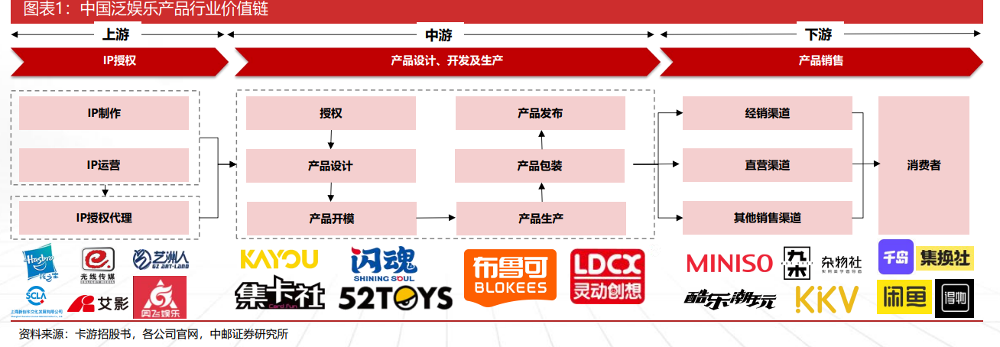

参考出处：[卡牌行业深度报告](https://robo.datayes.com/v2/details/report/7550873)

## 概念

泛娱乐产品是基于IP开发的实体产品，如玩具、文具以及其他消费品等

> 产品的主体可以是一个故事、一个角色或其他任何IP内容

**产品行业商业模式：**
根据自有IP或他人授权IP设计、开发、生产泛娱乐产品，并通过经销和直营等多种渠道把产品销售给消费者。上游企业进行IP创作以及IP授权代理，经由中游的企业将IP实体化为产品，最终通过经销商或零售商等渠道将产品送至消费者手中，消费者根据自身需求，通过交易平台进行产品的二次出售和互换，形成泛娱乐产品二级市场。

> 风险提示：政策变动风险，市场机制完善不及预期的风险，技术体系突变风险，下游需求不如预期，原材料价格波动超预期等。
